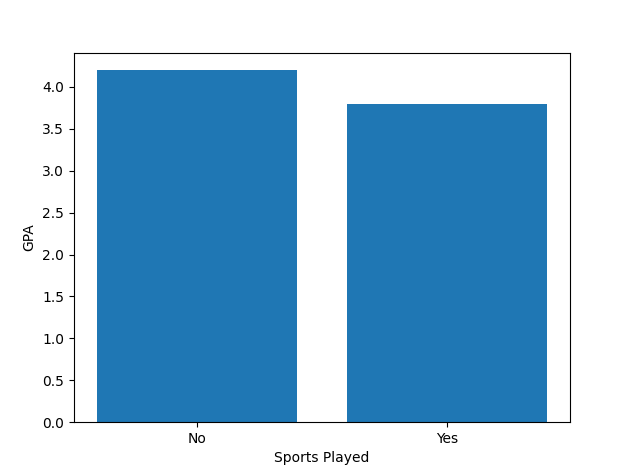
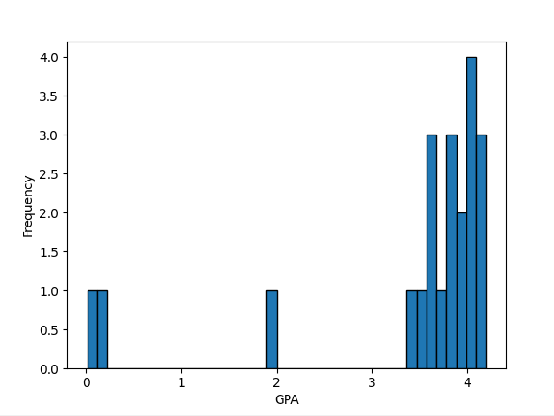
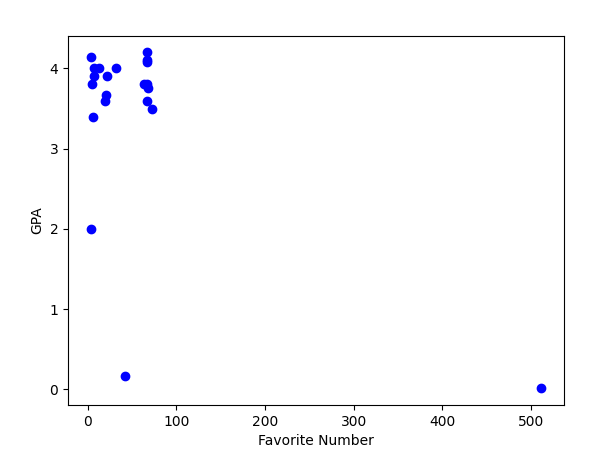

# Project 3 -  Student Submission

## Project Info
- **Project Title:** GPA vs Sports and Sports Related Culture
- **Your Name:** Kyan Fogarty
- **Date:** 10/10/2025

---

## Survey Information
- **Survey Topic:** _My survey aims to compare sports watched/played, and GPA along with school enjoyment in an individual._
- **Survey Link:** [Click here to view survey](https://forms.gle/bvgTbfhazJT9XwqA9)
- **Number of Responses:** _13_

---

## Survey Questions
List the questions you asked in your survey and their type:

| # | Question Text | Response Type (Multiple Choice / Numeric / Text) |
|---|---------------|-------------------------------------------------|
| 1 | _On a scale of 1-10, how often do you watch_ sports? | Linear Scale |
| 2 | _Do you play a sport for school?_ | Multiple Choice |
| 3 | _On a scale of 1-10, how much do you enjoy school?_ | _Linear Scale_ |
| 4 | _What is your GPA?_ | _Numeric_ |
| 5 | _What is your favorite number?_ | _Numeric_ |
---

## Data Overview
- **Link to Raw Data File (CSV):** [Download here](survey_data.csv)
- **Number of Columns:** _6_
- **Number of Rows:** _21_
- **Any Cleaning Steps Taken:** _I added random names to each answer, to help distinguish between them if needed._

---

## Charts Created
List each chart you made, its type, and what it shows. Add a link or embed an image if possible.

| # | Chart Title | Chart Type (Bar, Histogram, Scatter, etc.) | Brief Description | Link or Image |
|---|-------------|-------------------------------------------|-------------------|---------------|
| 1 | _GPA vs. sports played_ | Bar Chart | Shows the average GPA of people who play or don't play sports |  |
| 2 | _Distribution of GPA_ | Histogram | Shows the frequency of GPA in students |  |
| 3 | _Favorite Number vs GPA_ | Scatter Plot | Shows relationship between favorite number and GPA. |  |

---

## Data Analysis & Insights
Write a short analysis of your findings. Include at least one interesting insight from your data.

We found that students who play sports have an average **lower** GPA than students who do not play sports.

---

## Reflection
Answer briefly:
- What went well in your project?
    - Something that went well in this survey was a clear distinction between GPA and sports played.
- What was the most challenging part?
    - The most challening part was thinking of questions to ask people, along with organizing my findings.
- If you had more time, what would you do differently?
    - I would have asked questions about which specific type of sport someone plays, and then compare that to their GPA.
---

### Submission Checklist
- [1] Link to survey included
- [1] Questions listed
- [1] Raw data file attached or linked
- [1] 3+ charts created and linked/embedded
- [1] Data analysis section filled in